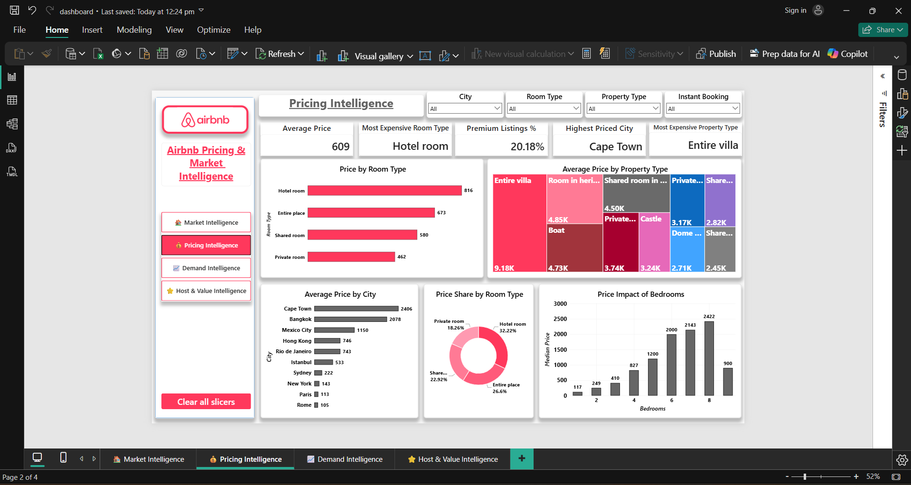
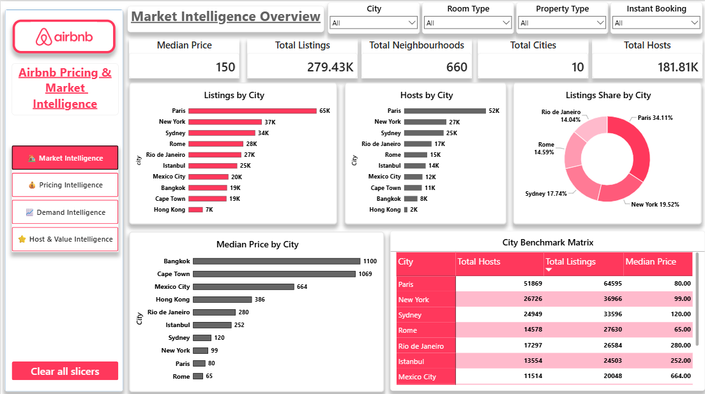
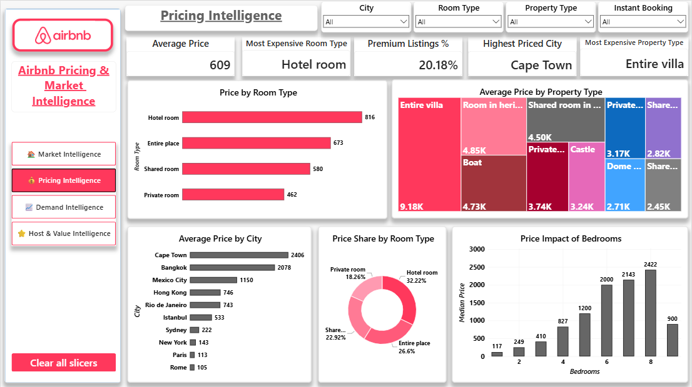
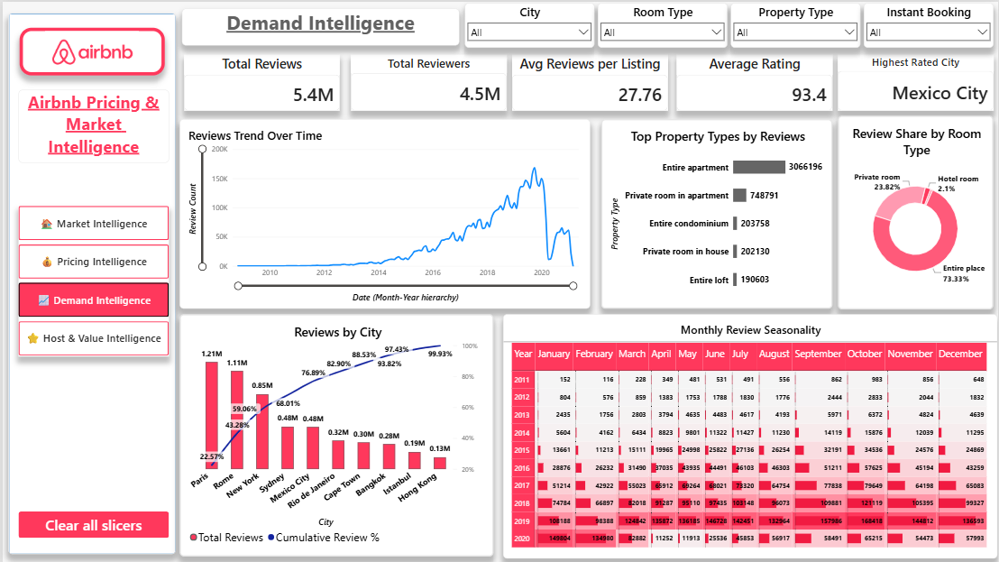
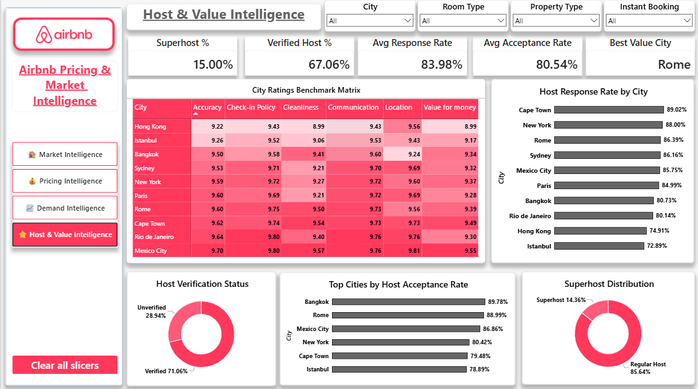

# 🏠 Airbnb Pricing & Market Intelligence

<p align="center">
  
</p>

<p align="center">


</p>

<p align="center">
<b>End-to-End Airbnb Analytics Project | PostgreSQL + SQL + Power BI</b>
</p>

<p align="center">
🌍 Market Intelligence • 💰 Pricing Intelligence • 📅 Demand Intelligence • ⭐ Host Intelligence
</p>

---

# 🚀 Project Overview

This project analyzes Airbnb marketplace performance across **10 major global cities** using an end-to-end analytics workflow covering data auditing, cleaning, modeling, SQL business analysis, KPI development, and Power BI dashboarding.

The objective is to transform Airbnb listing, host, and review data into actionable business intelligence focused on:

* 🌍 Market Intelligence
* 💰 Pricing Intelligence
* 📅 Demand Intelligence
* ⭐ Host Intelligence
* 🏆 Value Intelligence

### 🎯 Dataset Source

**Maven Analytics Airbnb Listings & Reviews Dataset**

---

# 📥 Data & Dashboard Setup

Large datasets and the Power BI dashboard file are excluded from this repository due to GitHub file size limitations.

📂 Google Drive Resources:

https://drive.google.com/drive/folders/1uQKPsijVQX_5HEVEIqLdIiB1TMBMYOMJ?usp=drive_link

📖 Detailed setup instructions:

```text
data/DATA_SETUP.md
```

The project can be fully reproduced by:

1. Downloading the raw dataset
2. Running the notebooks sequentially
3. Generating processed datasets
4. Downloading the Power BI dashboard
5. Refreshing the dashboard

---

# 📊 Project Snapshot

| Metric            |        Value |
| ----------------- | -----------: |
| Cities Covered    |           10 |
| Listings Analyzed |      279,434 |
| Hosts Evaluated   |      181,805 |
| Reviews Analyzed  | 5.37 Million |
| Dashboard Pages   |            4 |
| Business Domains  |            5 |

---

# 🎯 Business Objectives

✅ Compare Airbnb market characteristics across cities

✅ Identify key pricing drivers

✅ Analyze customer demand patterns and seasonality

✅ Evaluate host performance and customer satisfaction

✅ Build an executive-level Power BI dashboard

✅ Generate actionable business intelligence insights

---

# 🛠️ Technology Stack

| Category              | Tools        |
| --------------------- | ------------ |
| Programming           | Python       |
| Data Analysis         | Pandas       |
| Database              | PostgreSQL   |
| Querying              | SQL          |
| Business Intelligence | Power BI     |
| Documentation         | Markdown     |
| Version Control       | Git & GitHub |

---

# 📂 Project Structure

```text
Airbnb-Pricing-Market-Intelligence

├── .gitignore
├── README.md
├── requirements.txt
│
├── data
│   ├── DATA_SETUP.md
│   ├── processed
│   └── raw
│
├── images
│   ├── 01_Dashboard_Cover.png
│   ├── 02_Market_Intelligence_Overview.png
│   ├── 03_Pricing_Intelligence.png
│   ├── 04_Demand_Intelligence.png
│   └── 05_Host_and_Value_Intelligence.png
│
├── notebooks
│   ├── 01_Data_Audit.ipynb
│   ├── 02_Data_Cleaning.ipynb
│   ├── 03_Data_Modeling.ipynb
│   ├── 04_Business_Understanding.ipynb
│   ├── 05_Exploratory_Data_Analysis.ipynb
│   └── 06_KPI_Framework.ipynb
│
├── powerbi
│   └── Dashboard_Notes.md
│
├── reports
│   ├── Business_Report.md
│   └── Final_Project_Report.md
│
└── sql
    ├── 00_Create_Tables.sql
    ├── 01_Data_Validation.sql
    ├── 02_Analysis_Queries.sql
    └── SQL_Analysis_Summary.md
```

---

# 🔄 Analytics Workflow

```text
Business Understanding
        ↓
Data Audit
        ↓
Data Cleaning
        ↓
Data Modeling
        ↓
Exploratory Data Analysis
        ↓
KPI Framework
        ↓
SQL Business Analysis
        ↓
Power BI Dashboard
        ↓
Business Insights
```

---

# 💡 Key Insights

🌍 Paris emerged as the largest Airbnb market in the dataset.

💰 Bedrooms and accommodation capacity were identified as the strongest pricing drivers.

📅 Customer demand peaked in 2019 and demonstrated clear seasonal patterns.

⭐ Superhosts consistently achieved higher ratings and stronger pricing performance.

🏆 Rome delivered the highest value-for-travel score among analyzed cities.

---

# 📊 Dashboard Preview

## 🌍 Market Intelligence Overview



---

## 💰 Pricing Intelligence



---

## 📅 Demand Intelligence



---

## ⭐ Host & Value Intelligence



---

# 📥 Power BI Dashboard File

The PBIX dashboard file is excluded from this repository because it exceeds GitHub file size limitations.

The dashboard can be downloaded using the Google Drive resources link provided in the **Data & Dashboard Setup** section.

---

# 🧠 SQL Business Analysis

SQL was used to answer 15+ business questions across:

* 🌍 Market Intelligence
* 💰 Pricing Intelligence
* 📅 Demand Intelligence
* ⭐ Host Intelligence
* 🏆 Value Intelligence

Detailed findings are available in:

```text
sql/SQL_Analysis_Summary.md
```

---

# 📚 Project Documentation

| Document                | Purpose                              |
| ----------------------- | ------------------------------------ |
| DATA_SETUP.md           | Dataset & Dashboard Setup            |
| Dashboard_Notes.md      | Dashboard Design & KPI Documentation |
| Business_Report.md      | Executive Business Analysis          |
| Final_Project_Report.md | Technical Project Documentation      |
| SQL_Analysis_Summary.md | SQL Findings Summary                 |

---

# 🏆 Project Highlights

⭐ End-to-End Data Analytics Project

⭐ PostgreSQL + SQL + Power BI Integration

⭐ 279K+ Listings Analyzed

⭐ 181K+ Hosts Evaluated

⭐ 5.37M+ Reviews Processed

⭐ Multi-City Market Intelligence

⭐ Pricing & Demand Analytics

⭐ Host Performance Intelligence

⭐ Executive Dashboard Development

⭐ Portfolio-Ready Business Intelligence Project

---

# 👨‍💻 Author

## Shivam Mahawar

🔗 GitHub: https://github.com/shivammahawar123

---

<p align="center">
<b>🏠 Transforming Airbnb Marketplace Data into Business Intelligence</b>
</p>

<p align="center">
⭐ If you found this project interesting, consider giving it a star!
</p>
